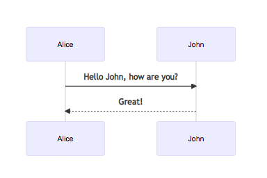
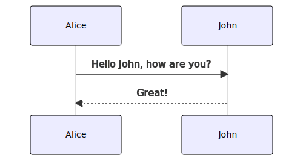

# Section One Title

## Intro slide title

A presentation about presentations.

## Slide one

  - point one
  - point two

## Slide two

This will not reveal incrementally, because it’s in a blockquote.

>   - point one
>   - point two

## Slide with a pause

content before the pause

. . .

### content after the pause

  - with
  - bullets

# Section Two

## Two-A

  - it’s a column\!

  - look, another one\!

# Section Three Title

## Mermaid diagram

Using a `data:` URI [doesn’t
work](https://github.com/github/markup/issues/270) on GitHub, so use
`loc=` to generate an external file.

This *does* show up in the Beamer slides, but weirdly positioned/sized,
no matter what I do.

## Mermaid diagram (PDF version)

Here a `.mermaid format=svg` hidden from slides in a “notes” section,
but shows up in the README.

The Makefile generates a PDF version that can is embedded into the next
slide with LaTeX’s `\includegraphics`. So sometimes you have to `make`
twice.\[1\]

## Mermaid diagram (PDF version, cont’d)

Here’s the `\includegraphics` version, using the PDF, which shows up in
the PDF slides but not the README. Hat tip to Jeromy
Anglim.\[2\]</small>

## A plain slide, bottom-aligned

Just a plain old slide.\[3\]

## Conclusion

QED.

## References / See Also

  - <https://garrettgman.github.io/rmarkdown/authoring_pandoc_markdown.html>
      - [incremental
        lists](https://garrettgman.github.io/rmarkdown/authoring_pandoc_markdown.html#incremental_lists)
      - [structuring the slide
        show](https://garrettgman.github.io/rmarkdown/authoring_pandoc_markdown.html#structuring_the_slide_show)
  - <https://github.com/jgm/pandoc/issues/5031>
      - basically, `\framesubtitle{The frame's subtitle}` is the only
        way
  - [beameruserguide.pdf](http://ctan.math.utah.edu/ctan/tex-archive/macros/latex/contrib/beamer/doc/beameruserguide.pdf)
  - <https://deic-web.uab.cat/~iblanes/beamer_gallery/>
  - [mermaid-filter](https://github.com/raghur/mermaid-filter)
      - [github/markup
        \#270](https://github.com/github/markup/issues/270) - GitHub
        doesn’t support `data:` URIs in Markdown
      - [How to include SVG diagrams in
        LaTeX?](https://tex.stackexchange.com/a/2107)
          - I just ended up using librsvg’s `svg2pdf` in the Makefile

1.  https://tex.stackexchange.com/questions/2099/how-to-include-svg-diagrams-in-latex

2.  https://jeromyanglim.blogspot.com/2012/07/beamer-pandoc-markdown.html

3.  Do footnotes work? (not in GitHub, they don’t)
